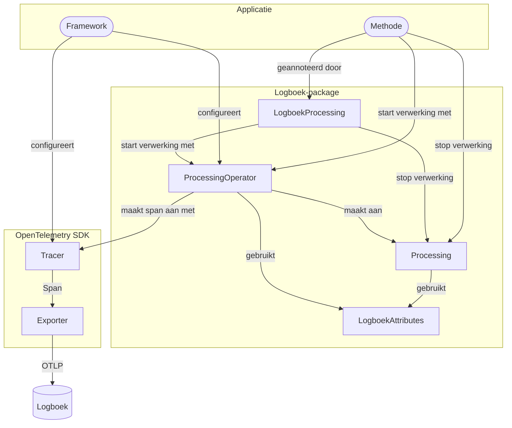

# Architectuur van de voorbeeldimplementaties

De volgende voorbeeldimplementaties delen dezelfde opzet qua architectuur: [.NET](./dotnet.mdx), [Java (Spring)](./java-spring.mdx), [PHP](./php.mdx) en [Python](./python.mdx).

Om [verwerkingen](https://gitdocumentatie.logius.nl/publicatie/logboek/dataverwerkingen/1.0.0/#dfn-dataverwerkingen) te loggen, wordt gebruikgemaakt van [Traces](https://opentelemetry.io/docs/concepts/signals/traces/) van het OpenTelemetry-framework. Een verwerking wordt aangemaakt als een [Span](https://opentelemetry.io/docs/concepts/signals/traces/#spans) met [attributen](https://opentelemetry.io/docs/concepts/signals/traces/#attributes). De verwerkingen (spans) worden opgestuurd naar een endpoint dat het [OpenTelemetry Protocol (OTLP)](https://opentelemetry.io/docs/specs/otlp/) kan verwerken. Dit endpoint kan het [Logboek](https://gitdocumentatie.logius.nl/publicatie/logboek/dataverwerkingen/1.0.0/#logboek) zijn of een component die ze doorstuurt naar het Logboek. Zo'n component kan een [OpenTelemetry Collector](https://opentelemetry.io/docs/collector/) zijn, maar dat hoeft niet.

## Logboek-package

Elke implementatie definieert een package waarmee de [Applicatie](https://gitdocumentatie.logius.nl/publicatie/logboek/dataverwerkingen/1.0.0/#applicatie) geconfigureerd kan worden om verwerkingen te loggen. Er wordt een [OpenTelemetry Tracer](https://opentelemetry.io/docs/concepts/signals/traces/#tracer) geconfigureerd die uitsluitend is bedoeld voor het loggen van deze verwerkingen. Dit zorgt voor een scheiding van eventuele bestaande observability-tracing in de Applicatie. Een OTLP-`Exporter` zorgt ervoor dat de verwerkingen (spans) naar het Logboek worden geschreven.

Spans worden niet direct met deze Tracer aangemaakt, maar via een `ProcessingOperator`. Met de `ProcessingOperator` worden bij het starten van verwerkingen (spans) de juiste [Logboek Dataverwerkingen-attributen](https://gitdocumentatie.logius.nl/publicatie/logboek/dataverwerkingen/1.0.0/#attributes) toegevoegd. Deze attributen worden gedefinieerd in `LogboekAttributes`.

Na het starten van een verwerking geeft de `ProcessingOperator` een `Processing` terug. Met de `Processing` wordt de verwerking ook weer gestopt en kan de identificatie van een [Betrokkene](https://gitdocumentatie.logius.nl/publicatie/logboek/dataverwerkingen/1.0.0/#loggen-van-dataverwerkingen-met-persoonsdata) worden opgegeven. Een naam en een verwijzing naar een Verwerkingsactiviteit zijn verplichte velden bij het starten.

Een verwerking kan ook gestart worden in de context van een andere Applicatie. Daarbij wordt de `traceparent`-header, onderdeel van de [W3C Trace Context](https://www.w3.org/TR/trace-context-1/)-standaard, gebruikt.

Een `LogboekProcessing`-annotatie, -attribuut of -decorator kan ook worden gebruikt om verwerkingen te starten. Het annoteren van een methode maakt het eenvoudig om verwerkingen te definiëren.

## Applicatie

De voorbeeldapplicaties definiëren elk een JSON-API met een endpoint. Bij het aanroepen van dit endpoint worden meerdere verwerkingen geregistreerd met een BSN als identificatie van een Betrokkene.

Het Logboek wordt op een manier geconfigureerd die voor de programmeertaal/framework gangbaar is. Dat gebeurt via dependency injection of door het registreren van een extensie, waarna een endpoint-URL wordt ingesteld.

## Diagram

In onderstaande diagram wordt de relatie tussen de verschillende onderdelen weergegeven.

