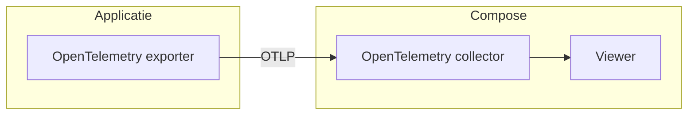

import Tabs from '@theme/Tabs';
import TabItem from '@theme/TabItem';


# OpenTelemetry viewer

Een hulpmiddel om eenvoudig traces te kunnen bekijken, ter ondersteuning van de implementatie van [Logboek Dataverwerkingen](../index.md).




## Compose

Maak de volgende twee bestanden aan:

<Tabs>
<TabItem value="compose" label="compose.yaml">

```yaml
services:
  collector:
    image: docker.io/otel/opentelemetry-collector:0.155.0@sha256:140cdb56eeea12ebc33bb4f7109fd4eef90391933f8d85b33384fcfe1cf040c4
    container_name: collector
    ports:
      - 127.0.0.1:4317:4317
      - 127.0.0.1:4318:4318
    volumes:
      - ./otelcol-config.yaml:/etc/otelcol/config.yaml
    depends_on:
      - viewer

  viewer:
    image: ghcr.io/ctrlspice/otel-desktop-viewer:v0.4.1@sha256:f4d9c5131d7f8c8cf18dc7f4265dcb344c6658055fc8170eec35105c83a379fd
    container_name: viewer
    ports:
      - 127.0.0.1:8000:8000
```

</TabItem>

<TabItem value="config" label="otelcol-config.yaml">

```yaml
receivers:
  otlp:
    protocols:
      grpc:
        endpoint: 0.0.0.0:4317
      http:
        endpoint: 0.0.0.0:4318

processors:
  batch:

exporters:
  otlp/viewer:
    endpoint: viewer:4317
    tls:
      insecure: true

service:
  pipelines:
    traces:
      receivers: [otlp]
      processors: [batch]
      exporters: [otlp/viewer]
```

</TabItem>
</Tabs>

## Starten

Start nu de containers met:

<Tabs>
<TabItem value="docker" label="Docker Compose">
```sh
docker compose up
```
</TabItem>

<TabItem value="podman" label="Podman Desktop">
```sh
podman compose up
```
</TabItem>
</Tabs>

De OpenTelemetry Collector is bereikbaar op:
- gRPC: `127.0.0.1:4317`
- HTTP: `127.0.0.1:4318`


## Traces bekijken

Ga met je browser naar http://127.0.0.1:8000/traces om de traces (verwerkingen) te bekijken.
