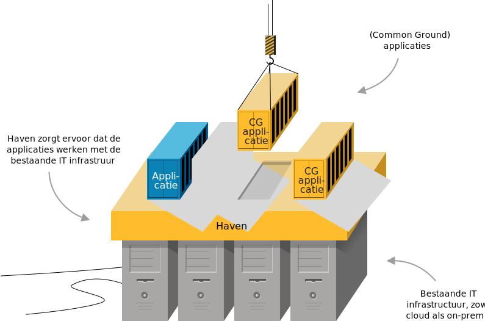
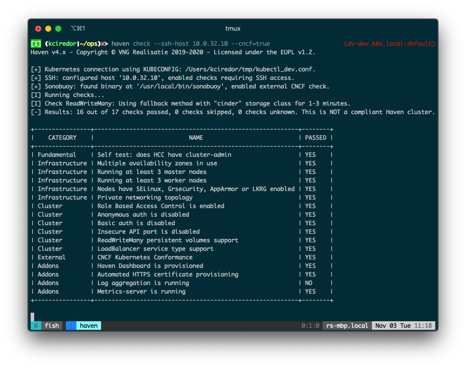

Haven is een standaard voor platform-onafhankelijke cloud hosting. Het is een project dat is ontstaan vanuit de wens van Nederlandse gemeenten om op een uniforme manier hun Kubernetes cloud hosting te organiseren. Het project is onderdeel van de Common Ground architectuurvisie. Common Ground is een initiatief van de Vereniging van Nederlandse Gemeenten (VNG) waarin samengewerkt wordt aan principes voor een toekomstbestendige digitale architectuur.

## Voordelen

### ✅ Stimuleert hergebruik
Haven maakt het makkelijker om open source applicaties tussen organisaties te hergebruiken. Door dat Haven een specificatie biedt voor hoe die applicaties precies opgezet moeten zijn ontstaat er een gezamenlijk referentiekader.

Voorbeelden van applicaties die geschikt zijn voor Haven:
- [Signalen](https://github.com/signalen)
- [Generiek Zaakafhandelcomponent](https://github.com/generiekzaakafhandelcomponent) 
- [Keycloak](https://github.com/keycloak/keycloak)

### ✅ Correct gebruik van Kubernetes
De learning curve van Kubernetes is behoorlijk stijl. De Haven standaard zorgt ervoor dat je belangrijke principes volgt. Voorbeelden hiervan zijn het verzamelen van metrics maar ook dat je een recente versie van Kubernetes draait.

### ✅ Duidelijkheid voor inkopers en leveranciers
Bij aanbestedingen is duidelijkheid cruciaal. Wanneer een gemeentelijke inkoper om een "Haven Compliant" applicatie of cluster vraagt, weet de leverancier precies wat er opgeleverd moet worden, wat leidt tot efficiëntere offertes en betere afstemming.

### ✅ Security
De checks waaruit de Haven standaard bestaat, bestaan voor een deel uit security-checks. 

### ✅ Voorkomen van vendor lock-in
Omdat Haven open source is kan elke leverancier die daar oren naar heeft een Haven Compliant Kubernetes Cluster opleveren. 

### ✅ Haven is een levende standaard
Haven is een standaard die door verschillenden gemeentes en leveranciers van gemeentes in de praktijk wordt gebruikt. Veel Leveranciers geven aan dat ze blij zijn met de Haven standaard omdat het ze duidelijkheid geeft bij de communicatie met gemeenten. 

## Zorgt Haven ervoor dat ik pijnloos van bijvoorbeeld AWS naar Azure kan overstappen?
Als organisatie is het goed om na te denken over digitale souvereiniteit.

## Hoe maak ik mijn applicatie geschikt voor een Haven Cluster?
De voorwaarden voor een project om op een Haven Cluster te kunnen draaien zijn:

- De opzet moet containerized zijn (bijvoorbeeld met Docker)
- Het project moet Helm charts bevatten
- Er moet een endpoint beschikbaar zijn voor metrics
- De app moeten kunnen schalen naar meerdere replica's

Op dit moment is er nog geen tooling of validator die checkt of je applicatie voldoet aan de voorwaarden om te draaien op een Haven Cluster.

## Haven Compliancy Checker
Deze CLI Tool stelt je in staat om pro-actief je Kubernetes cluster Haven Compliant te houden.

- [Meer info over Haven Comliancy Checker](./haven-compliancy-checker)

## Haven+
Haven+ is een set aan componenten die gezamenlijk de volgende dingen voor je doet: monitoring (metrics, logging en tracing), authenticatie, databases, certificaatbeheer, secret management.

[Naar ons artikel over Haven+](./haven-plus.md)

## Welke organisaties werken met Haven?

- [Gemeente Utrecht](https://utrecht.nl)
- [WIGO4IT](https://www.wigo4it.nl/nieuws/haven-compliancy-bij-wigo4it/)
- [Surf](https://www.surf.nl/files/2024-10/surf-cloud-sourcing-strategie.pdf)

## Links
- [Gitlab Haven](https://gitlab.com/commonground/haven/haven)
- [Website Haven](https://haven.commonground.nl/)