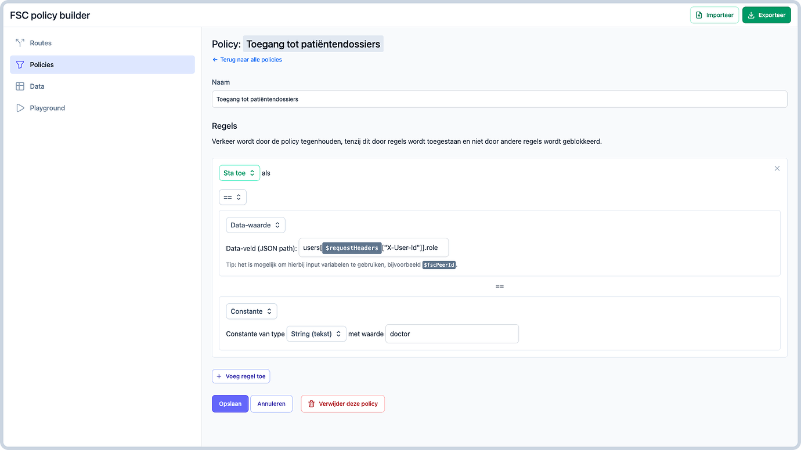
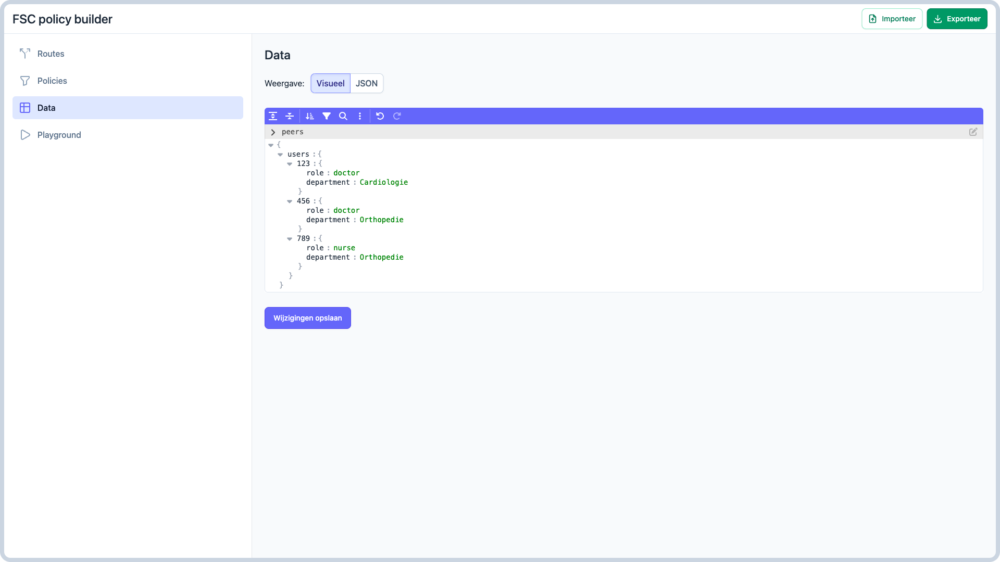

Overheidsorganisaties delen regelmatig gegevens met andere
(overheids)organisaties.
[Federatieve Service Connectivity (FSC)](https://nlx.io/) is een standaard (in
wording d.d. jun 2024) voor veilige digitale gegevensuitwisseling, ontwikkeld
door de overheid. Vaak is het echter wenselijk om deze gegevensuitwisseling te
beperken door bepaalde regels, zogenaamde policies. Digilab heeft een tool
ontwikkeld om het maken en beheren van zulke policies eenvoudiger te maken.

FSC zorgt voor de _autorisatie_ van de vragende partij: een verzoek wordt wel of
niet doorgelaten. Daarnaast is er vaak sprake van _authenticatie_: de vragende
gebruiker of partij wordt gecontroleerd op bevoegdheden om de data te mogen
inzien.

## Soorten authenticatie

Voor het authenticeren van een gebruiker of partij zijn de volgende modellen
gebruikelijk:

- **RBAC:** Role-Based Access Control. Voorbeeld: gebruikers met de rol 'admin'
  mogen bepaalde gegevens inzien, andere gebruikers niet.

- **ABAC:** Attribute-Based Access Control. Voorbeeld: een arts kan de
  patiëntendossiers inzien van patiënten die aan hem/haar zijn toegewezen.

- **PBAC:** Policy-Based Access Control. Voorbeeld: managers van een organisatie
  kunnen financiële rapportages inzien, maar alleen tijdens kantooruren op
  werkdagen.

Van deze modellen is de laatste (PBAC) het meest uitgebreid en flexibel. FSC
heeft een extensie waarmee ingaande of uitgaande verzoeken kunnen worden
getoetst aan policies. Dit gebeurt door Open Policy Agent.

## Open Policy Agent

Open Policy Agent (OPA) is een systeem dat verzoeken tot toegang van data kan
toetsen aan policies. OPA gebruikt daarvoor de programmeertaal Rego, waarin
policies kunnen worden gedefinieerd.

Een voorbeeld van zo'n policy is:

```nginx

package rego
import rego.v1
default allow := false

allow if {
  input.method == "GET"
  regex.match(`^/dossiers/(.*)$`, input.path)
  data.users[input.requestHeaders["X-User-Id"]].role == "doctor"
}

```

Het schrijven van zulke policies vereist enige kennis van de programmeertaal
Rego. Rego-policies kunnen relatief gecompliceerd worden. Om dit te
vereenvoudigen, heeft Digilab een policy builder ontwikkeld. Dit is een
low-code/no-code tool waarmee iedereen gemakkelijk policies kan schrijven. De
tool is specifiek gericht op het maken van FSC policies.

De FSC policy builder is te vinden op
[fsc-policy-builder.apps.digilab.network](https://fsc-policy-builder.apps.digilab.network/).

Met de tool kunnen relatief eenvoudig policies worden geschreven. Die kunnen
vervolgens worden geëxporteerd en geïmporteerd.

De FSC policy builder maakt onderscheid tussen routes, policies en data:

- **Routes** zijn paden (delen van URLs) waarop requests binnenkomen,
  bijvoorbeeld `/api/v1/books` voor een website van een boekenwinkel.

- **Policies** bevatten regels over of binnenkomende requests wel of niet
  goedgekeurd moeten worden.

- **Data** bevat data waar in policies naar verwezen wordt, bijvoorbeeld een
  lijst van gebruikers met bijbehorende rechten.

Een voorbeeld een vergelijkbare policy als de bovenstaande is te zien in de
volgende screenshot:


(Hierbij wordt ervan uitgegaan dat de service die het verzoek doet de goede
`X-User-Id` request header meegeeft, dus dat de eindgebruiker niet zelf het
request kan aanpassen.)

Een voorbeeld van bijbehorende data is te zien in de volgende screenshot:



Het voordeel van de splitsing tussen policies en data is dat de data kan worden
gewijzigd zonder dat de policies zelf hoeven te worden aangepast. Bijvoorbeeld
kan een gebruiker andere rechten of eigenschappen krijgen, zonder dat de
policies daarvoor hoeven te worden aangepast.

De policies kunnen eventueel worden getoetst aan verschillende invoer met behulp
van een zogenaamde _playground_ die onderdeel is van de policy builder.

## Policies implementeren

Wanneer een policy is aangemaakt, wat is dan de vervolgstap om deze te
implementeren?

Wanneer met behulp van de policy builder een policy is aangemaakt, kan deze
worden geëxporteerd als Rego-bestand. De werknemer of partij die FSC heeft
opgezet kan vervolgens
[Open Policy Agent activeren](https://docs.nlx.io/nlx-in-production/setup-authorization/),
waarna de policy kan worden ingesteld.

## Beperkingen

De FSC policy builder heeft verschillende limitaties:

- De tool is bedoeld om op weg te helpen en minder geschikt voor uitgebreide
  policies. Rego is een programmeertaal met uitgebreide mogelijkheden, die
  lastig allemaal te vatten zijn in een low-code tool.

- De tool is beperkt tot Rego/OPA. Er zijn andere systemen voor
  PBAC-authenticatie. Mogelijk wordt de tool in de toekomst uitgebreid om meer
  systemen te ondersteunen.

De FSC policy builder is te vinden op
[fsc-policy-builder.apps.digilab.network](https://fsc-policy-builder.apps.digilab.network/).
