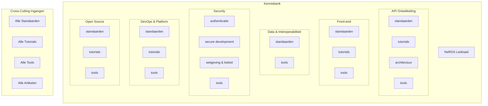

# Kennisbank Structuur - Voorstel

## Visueel Overzicht



---

## Hoofdcategorieën (7)

| # | Categorie | Beschrijving | URL |
|---|-----------|--------------|-----|
| 1 | **API Ontwikkeling** | Design, architectuur en tooling voor API's | `/kennisbank/api-ontwikkeling/` |
| 2 | **Front-end** | NL Design System, toegankelijkheid, libraries | `/kennisbank/front-end/` |
| 3 | **Data & Interoperabiliteit** | Linked data, dataformaten, datastandaarden | `/kennisbank/data/` |
| 4 | **Security** | Authenticatie, secure development, wetgeving | `/kennisbank/security/` |
| 5 | **DevOps & Platform** | Kubernetes, deployment, monitoring | `/kennisbank/devops/` |
| 6 | **Open Source** | Licenties, repositories, community | `/kennisbank/open-source/` |
| 7 | **NeRDS Leidraad** | 13 principes voor softwareontwikkeling | `/kennisbank/leidraad/` |

---

## Subcategorieën per Hoofdcategorie

### 1. API Ontwikkeling

| Subcategorie | Wat hoort hier? |
|--------------|-----------------|
| `standaarden/` | API Design Rules, OpenAPI Specification, CloudEvents |
| `tutorials/` | Bouw een API, Maak een OAS |
| `architectuur/` | Event Driven Architecture, Webhooks, Problem Details |
| `tools/` | WuppieFuzz, ADR Linter, ADR Validator, OAS Generator |

---

### 2. Front-end

| Subcategorie | Wat hoort hier? |
|--------------|-----------------|
| `standaarden/` | DigiToegankelijk (WCAG), NL Design System |
| `tutorials/` | Aan de slag met NL Design System |
| `tools/` | GemeenteIconen, Axe, Maps.amsterdam |

---

### 3. Data & Interoperabiliteit

| Subcategorie | Wat hoort hier? |
|--------------|-----------------|
| `standaarden/` | Logboek Dataverwerkingen, JSON/YAML, Linked Data (RDF, DCAT, SKOS, SHACL, OWL) |
| `tools/` | *(nog geen tools)* |

---

### 4. Security

| Subcategorie | Wat hoort hier? |
|--------------|-----------------|
| `authenticatie/` | **Voorzieningen:** DigiD, eHerkenning, PKIoverheid |
|  | **Protocollen:** OAuth, OIDC, SAML |
| `secure-development/` | OWASP, Secure Software Development |
| `wetgeving-en-beleid/` | **EU:** eIDAS, NIS2, EUDI Wallet |
|  | **NL:** BIO, Wet digitale overheid |
| `tools/` | OpenKAT, security.txt |

---

### 5. DevOps & Platform

| Subcategorie | Wat hoort hier? |
|--------------|-----------------|
| `standaarden/` | Haven (Kubernetes), FSC |
| `tutorials/` | Haven compliancy checker |
| `tools/` | Quality-time, FSC Policy Builder |

---

### 6. Open Source

| Subcategorie | Wat hoort hier? |
|--------------|-----------------|
| `standaarden/` | Publiccode.yml, README.md, CONTRIBUTING.md, CODE_OF_CONDUCT.md, SECURITY.md, PROJECT_GOVERNANCE.md, Standaard voor publieke code |
| `tutorials/` | Gitflow, Licentie kiezen, Repository inrichten, Project checklist |
| `tools/` | Publiccode.yml editor, Publiccode.yml parser |
| *(los)* | Communities |

---

### 7. NeRDS Leidraad

| Principe | Titel |
|----------|-------|
| 1 | Werk vanuit de behoefte van de gebruiker |
| 2 | Maak producten toegankelijk en inclusief |
| 3 | Werk open source |
| 4 | Gebruik open standaarden |
| 5 | Cloud-native softwareontwikkeling |
| 6 | Beveilig systemen en data |
| 7 | Neem privacy als uitgangspunt |
| 8 | Deel, hergebruik en werk samen |
| 9 | Integreer technologie in bestaande systemen |
| 10 | Werk agile en verhoog de slagingskans |
| 11 | Maak correct gebruik van data |
| 12 | Bepaal je inkoopstrategie |
| 13 | Denk na over duurzaamheid |

---

## Cross-Cutting Ingangen

| Pagina | URL | Beschrijving |
|--------|-----|--------------|
| **Alle Standaarden** | `/kennisbank/standaarden/` | Overzicht van alle standaarden, gegroepeerd per categorie |
| **Alle Tools** | `/kennisbank/tools/` | Overzicht van alle tools |
| **Alle Tutorials** | `/kennisbank/tutorials/` | Overzicht van alle tutorials |
| **Alle Artikelen** | `/kennisbank/alles/` | Volledig overzicht, sorteerbaar en filterbaar |

---

## URL Wijzigingen (Redirects)

| Oude URL | Nieuwe URL | Actie |
|----------|------------|-------|
| `/kennisbank/apis/` | `/kennisbank/api-ontwikkeling/` | Redirect |
| `/kennisbank/security/` | `/kennisbank/security/` | Behouden (alleen herstructureren) |
| `/kennisbank/infra/` | `/kennisbank/devops/` | Redirect |
| `/kennisbank/programmeertalen/` | `/kennisbank/api-ontwikkeling/` | Redirect (Rust integreert) |

---

## Homepage Structuur

```
┌─────────────────────────────────────────────────────────────┐
│  HERO: "Eén plek voor developers bij de overheid"           │
│  Korte intro + zoekbalk                                     │
├─────────────────────────────────────────────────────────────┤
│  HOOFDCATEGORIEËN (6 kaarten)                               │
│                                                             │
│  ┌───────────┐  ┌───────────┐  ┌───────────┐               │
│  │ API       │  │ Front-end │  │ Data &    │               │
│  │ Ontwikkel │  │           │  │ Interop   │               │
│  └───────────┘  └───────────┘  └───────────┘               │
│  ┌───────────┐  ┌───────────┐  ┌───────────┐               │
│  │ Security  │  │ DevOps &  │  │ Open      │               │
│  │           │  │ Platform  │  │ Source    │               │
│  └───────────┘  └───────────┘  └───────────┘               │
├─────────────────────────────────────────────────────────────┤
│  SNELLE INGANGEN (3 kaarten)                                │
│                                                             │
│  ┌──────────────┐ ┌──────────────┐ ┌──────────────┐        │
│  │ Alle         │ │ Alle Tools   │ │ Alle         │        │
│  │ Standaarden  │ │              │ │ Tutorials    │        │
│  └──────────────┘ └──────────────┘ └──────────────┘        │
├─────────────────────────────────────────────────────────────┤
│  NERDS LEIDRAAD                                             │
│  "13 principes voor softwareontwikkeling bij de overheid"   │
├─────────────────────────────────────────────────────────────┤
│  ANDERE INGANGEN                                            │
│  Techradar · Implementatieondersteuning · Communities · Blog│
└─────────────────────────────────────────────────────────────┘
```

---

## Wijzigingen t.o.v. Huidige Structuur

| Was | Wordt | Reden |
|-----|-------|-------|
| Security (alleen auth) | Security (breder) | Security is meer dan authenticatie |
| Infra | DevOps & Platform | Duidelijkere naam |
| Programmeertalen | *(opgeheven)* | Te weinig content, Rust naar API's |
| Geen cross-cutting | Alle Standaarden/Tools/Tutorials | Betere vindbaarheid |
| Inconsistente subcategorieën | Vaste set per categorie | Consistentie |
