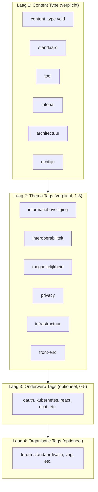

# Kennisbank - Tagging Strategie

Dit document beschrijft de tagging strategie voor de kennisbank.

---

## Huidige Situatie

Er zijn ~130 tags in `tags.yml`, maar:
- Geen hiërarchie of structuur
- Inconsistent gebruik (1-12 tags per artikel)
- Overlap met content types (`tutorial`, `tool` zijn tags én content types)
- Geen duidelijke richtlijnen

---

## Gelaagde Tagging Strategie

### Overzicht



---

## Laag 1: Content Type (verplicht)

**Dit is GEEN tag, maar een apart frontmatter veld.**

| Content Type | Gebruik voor |
|--------------|--------------|
| `standaard` | Specificaties, protocollen, formaten |
| `tool` | Software, validators, editors |
| `tutorial` | Stapsgewijze handleidingen |
| `architectuur` | Patronen en concepten |
| `richtlijn` | NeRDS leidraad content |

```yaml
---
content_type: standaard    # Niet in tags array!
---
```

---

## Laag 2: Thema Tags (verplicht)

Brede thematische tags. Elk artikel krijgt **minimaal 1, maximaal 3** thema tags.

| Tag | Beschrijving | Voorbeelden |
|-----|--------------|-------------|
| `informatiebeveiliging` | Security, authenticatie, encryptie | OAuth, DigiD, OpenKAT |
| `interoperabiliteit` | Data-uitwisseling, API's, standaarden | API Design Rules, DCAT, FSC |
| `toegankelijkheid` | WCAG, inclusiviteit, UX | DigiToegankelijk, NL Design System |
| `privacy` | AVG, gegevensbescherming, logging | Logboek Dataverwerkingen, BSN |
| `infrastructuur` | Kubernetes, deployment, cloud | Haven, Quality-time |
| `front-end` | UI, design systems, libraries | NL Design System, React |
| `open-source` | Licenties, community, governance | Publiccode.yml, CONTRIBUTING.md |

### Afstemming met Forum Standaardisatie

| Onze tag | Forum Standaardisatie equivalent |
|----------|----------------------------------|
| `informatiebeveiliging` | Informatiebeveiliging |
| `interoperabiliteit` | Interoperabiliteit |
| `toegankelijkheid` | Toegankelijkheid |

---

## Laag 3: Onderwerp Tags (optioneel)

Specifieke technologieën, standaarden, of concepten. **Maximaal 5** per artikel.

### Categorieën

| Categorie | Voorbeelden |
|-----------|-------------|
| **Protocollen** | `oauth`, `oidc`, `saml`, `mtls` |
| **Formaten** | `json`, `yaml`, `rdf`, `dcat` |
| **Technologieën** | `kubernetes`, `docker`, `react`, `rust` |
| **Standaarden** | `adr`, `oas`, `wcag`, `haven` |
| **Tools** | `wuppiefuzz`, `openkat`, `axe` |

### Regels
- Alleen tags voor **directe relatie** met het artikel
- Geen algemene termen die al in thema tags zitten
- Gebruik bestaande tags uit `tags.yml` waar mogelijk

---

## Laag 4: Organisatie Tags (optioneel)

Voor content gerelateerd aan specifieke organisaties of initiatieven.

| Tag | Gebruik voor |
|-----|--------------|
| `forum-standaardisatie` | Standaarden op de pas-toe-of-leg-uit lijst |
| `kennisplatform-apis` | Content van Kennisplatform API's |
| `vng` | VNG gerelateerde initiatieven |
| `common-ground` | Common Ground architectuur |

---

## Voorbeeld: Correct Getagd Artikel

```yaml
---
title: "OAuth 2.0"
content_type: standaard
tags:
  # Laag 2: Thema (verplicht)
  - informatiebeveiliging
  - interoperabiliteit

  # Laag 3: Onderwerp (optioneel)
  - oauth
  - oidc
  - api

  # Laag 4: Organisatie (optioneel)
  - forum-standaardisatie
---
```

---

## Tagging Regels

### Verplicht

| Regel | Toelichting |
|-------|-------------|
| Minimaal 1 thema tag | Elk artikel moet vindbaar zijn via thema |
| Maximaal 3 thema tags | Voorkom "alles is relevant" |
| Geen content type als tag | `tutorial` en `tool` zijn content types, geen tags |

### Aanbevolen

| Regel | Toelichting |
|-------|-------------|
| Maximaal 8 tags totaal | Meer is zelden nuttig |
| Specifiek boven algemeen | `oauth` is beter dan alleen `security` |
| Consistente spelling | Gebruik bestaande tags uit `tags.yml` |

### Verboden

| Niet doen | Waarom niet |
|-----------|-------------|
| `tags: [tutorial]` | Is een content type |
| `tags: [tool]` | Is een content type |
| `tags: [architectuur]` | Is een content type |
| `tags: [security]` | Gebruik `informatiebeveiliging` |

---

## Tags om te Wijzigen in tags.yml

### Verwijderen (worden content types)

- `tutorial`
- `tool`
- `architectuur`

### Hernoemen

| Oud | Nieuw | Reden |
|-----|-------|-------|
| `security` | `informatiebeveiliging` | Afstemming Forum Standaardisatie |
| `api-design` | *(mergen naar `api`)* | Vermijd dubbele tags |

### Toevoegen

| Tag | Beschrijving |
|-----|--------------|
| `interoperabiliteit` | Thema tag voor data-uitwisseling |
| `wetgeving` | Voor NIS2, eIDAS, BIO, etc. |

---

## Tag Pagina's

Docusaurus genereert automatisch overzichtspagina's per tag:

| URL | Toont |
|-----|-------|
| `/kennisbank/tags/informatiebeveiliging` | Alle security-gerelateerde artikelen |
| `/kennisbank/tags/oauth` | Alle OAuth-gerelateerde artikelen |
| `/kennisbank/tags/forum-standaardisatie` | Alle Forum Standaardisatie standaarden |

---

## Relatie met Andere Systemen

### Tech Radar
- Tech Radar items krijgen dezelfde onderwerp tags
- Maakt cross-linking mogelijk
- Voorbeeld: Rust in Tech Radar linkt naar artikelen met tag `rust`

### Blog
- Blogs gebruiken dezelfde `tags.yml`
- Thema tags maken "gerelateerde artikelen" mogelijk
- Voorbeeld: Blog over OAuth toont kennisbankartikelen met tag `oauth`

---

## Implementatie Checklist

- [ ] `tags.yml` opschonen (verwijder content type tags)
- [ ] Thema tags toevoegen aan `tags.yml`
- [ ] Bestaande artikelen controleren en tags aanpassen
- [ ] Documentatie voor content auteurs schrijven
- [ ] Tag pagina's testen
