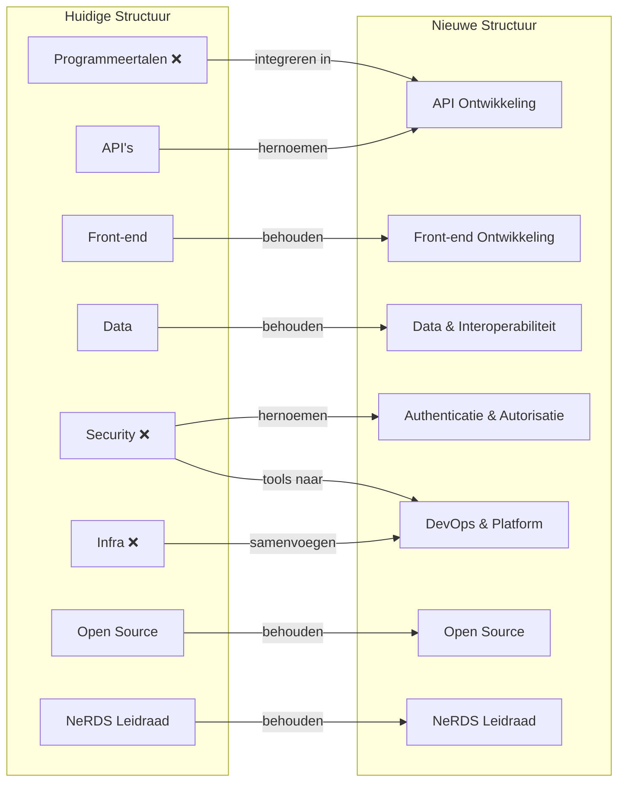
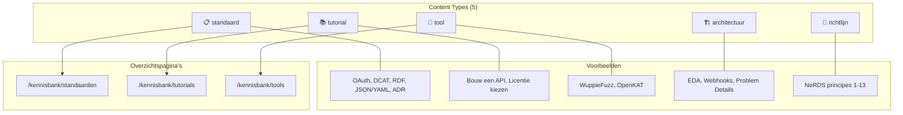
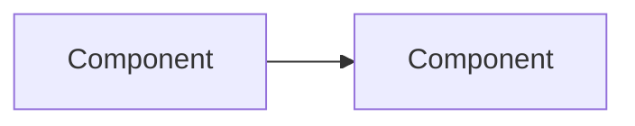

# Plan: Kennisbank Herstructurering

## Visueel Overzicht

```mermaid
flowchart TB
    subgraph KENNISBANK["🏛️ KENNISBANK"]
        direction TB

        subgraph API["API Ontwikkeling"]
            API_T["📚 tutorials"]
            API_S["📋 standaarden"]
            API_A["🏗️ architectuur"]
            API_O["🔧 tools"]
        end

        subgraph FE["Front-end Ontwikkeling"]
            FE_T["📚 tutorials"]
            FE_S["📋 standaarden"]
            FE_O["🔧 tools"]
        end

        subgraph DATA["Data & Interoperabiliteit"]
            DATA_S["📋 standaarden"]
        end

        subgraph AUTH["Authenticatie & Autorisatie"]
            AUTH_NL["🇳🇱 NL voorzieningen"]
            AUTH_P["🔐 Protocollen"]
            AUTH_EU["🇪🇺 EU regelgeving"]
        end

        subgraph DEVOPS["DevOps & Platform"]
            DEV_S["📋 standaarden"]
            DEV_T["📚 tutorials"]
            DEV_O["🔧 tools"]
        end

        subgraph OS["Open Source"]
            OS_S["📋 standaarden"]
            OS_T["📚 tutorials"]
            OS_O["🔧 tools"]
        end

        subgraph LEIDRAAD["NeRDS Leidraad"]
            L1["1-13 Principes"]
        end
    end

    subgraph CROSS["Cross-Cutting Navigatie"]
        ALL_S["📋 Alle Standaarden"]
        ALL_T["📚 Alle Tutorials"]
        ALL_O["🔧 Alle Tools"]
    end

    API_S --> ALL_S
    FE_S --> ALL_S
    DATA_S --> ALL_S
    AUTH_NL --> ALL_S
    AUTH_P --> ALL_S
    AUTH_EU --> ALL_S
    DEV_S --> ALL_S
    OS_S --> ALL_S

    API_T --> ALL_T
    FE_T --> ALL_T
    DEV_T --> ALL_T
    OS_T --> ALL_T

    API_O --> ALL_O
    FE_O --> ALL_O
    DEV_O --> ALL_O
    OS_O --> ALL_O
```



## Migratie Overzicht



## Content Type Systeem



---

## Gekozen Aanpak

- **Hoofdstructuur:** Optie C - Functionele herindeling
- **Programmeertalen:** Verwijderen als categorie (Rust content integreren)
- **URL wijzigingen:** Toegestaan met redirects

---

## Nieuwe Hoofdstructuur (6 categorieën)

```
Kennisbank
├── API Ontwikkeling              (was: API's)
├── Front-end Ontwikkeling        (was: Front-end)
├── Data & Interoperabiliteit     (was: Data)
├── Authenticatie & Autorisatie   (was: Security)
├── DevOps & Platform             (was: Infra + security tools)
├── Open Source                   (ongewijzigd)
└── NeRDS Leidraad               (ongewijzigd)
```

### URL Mapping

| Oud                             | Nieuw                           | Redirect nodig      |
| ------------------------------- | ------------------------------- | ------------------- |
| `/kennisbank/apis/`             | `/kennisbank/api-ontwikkeling/` | Ja                  |
| `/kennisbank/front-end/`        | `/kennisbank/front-end/`        | Nee                 |
| `/kennisbank/data/`             | `/kennisbank/data/`             | Nee                 |
| `/kennisbank/security/`         | `/kennisbank/authenticatie/`    | Ja                  |
| `/kennisbank/infra/`            | `/kennisbank/devops/`           | Ja                  |
| `/kennisbank/programmeertalen/` | _(verwijderd)_                  | Redirect naar API's |
| `/kennisbank/open-source/`      | `/kennisbank/open-source/`      | Nee                 |
| `/kennisbank/leidraad/`         | `/kennisbank/leidraad/`         | Nee                 |

---

## Gedetailleerde Nieuwe Structuur

### 1. API Ontwikkeling

```
api-ontwikkeling/
├── tutorials/
│   ├── bouw-een-api.md
│   └── maak-een-oas.md
├── standaarden/
│   ├── api-design-rules/           (incl. hoe-te-voldoen, cheat-sheet)
│   ├── openapi-specification.md
│   └── rust.md                     (van programmeertalen)
├── architectuur/
│   ├── event-driven-architecture.md
│   ├── cloudevents.md
│   ├── webhooks.md
│   ├── problem-details.md
│   ├── optimistic-locking.md
│   └── idempotency.md
└── tools/
    ├── wuppiefuzz.md
    ├── adr-linter.md
    ├── adr-validator.md
    └── oas-generator.md
```

### 2. Front-end Ontwikkeling

```
front-end/
├── tutorials/
│   └── aan-de-slag-nl-design-system.md
├── standaarden/
│   ├── digitoegankelijk/           (WCAG)
│   ├── nl-design-system.md
│   └── formatting-linting.md
└── tools/
    ├── gemeente-iconen.md
    ├── axe.md
    └── maps-amsterdam.md
```

### 3. Data & Interoperabiliteit

```
data/
├── standaarden/
│   ├── logboek-dataverwerkingen/
│   ├── json-yaml.md
│   └── linked-data/
│       ├── rdf.md
│       ├── dcat.md
│       ├── skos.md
│       ├── shacl.md
│       └── owl.md
└── tools/
    (geen tools momenteel)
```

### 4. Authenticatie & Autorisatie

```
authenticatie/
├── standaarden/
│   ├── nederlandse-voorzieningen/
│   │   ├── digid.md
│   │   ├── eherkenning.md
│   │   └── pkioverheid.md
│   ├── protocollen/
│   │   ├── oauth.md
│   │   ├── oidc.md
│   │   └── saml.md
│   ├── eu-regelgeving/
│   │   ├── eidas.md
│   │   ├── eudi-wallet.md
│   │   ├── nis1.md
│   │   ├── nis2.md
│   │   └── bio.md
│   └── security-txt.md
└── tools/
    (geen tools momenteel)
```

### 5. DevOps & Platform

```
devops/
├── standaarden/
│   ├── haven/                      (Kubernetes)
│   │   ├── index.md
│   │   └── haven-plus.md
│   └── fsc/                        (Service Connectivity)
├── tutorials/
│   └── haven-compliancy-checker.md
└── tools/
    ├── openkat.md                  (van security)
    ├── quality-time.md
    └── fsc-policy-builder.md
```

### 6. Open Source (ongewijzigd)

```
open-source/
├── communities.md                  (losse pagina)
├── standaarden/
│   ├── publiccode-yml.md
│   ├── readme-md.md
│   ├── contributing-md.md
│   ├── code-of-conduct-md.md
│   ├── security-md.md
│   ├── project-governance-md.md
│   └── standaard-voor-publieke-code.md
├── tutorials/
│   ├── git-open-source.md
│   ├── licentie-kiezen.md
│   ├── project-checklist.md
│   ├── repository-inrichten.md
│   └── publiccode-yml-toevoegen.md
└── tools/
    ├── publiccode-yml-editor.md
    └── publiccode-yml-parser.md
```

### 7. NeRDS Leidraad (ongewijzigd)

```
leidraad/
├── 1-behoefte-gebruiker/
├── 2-toegankelijk-inclusief/
├── 3-open-source/
├── 4-open-standaarden/
├── 5-cloud/
├── 6-security/
├── 7-privacy/
├── 8-hergebruik/
├── 9-integreer/
├── 10-agile/
├── 11-correct-data/
├── 12-inkoop/
└── 13-duurzaamheid/
```

---

## Cross-Cutting Navigatie

### Content Type Frontmatter

Elk document krijgt:

```yaml
---
title: "OAuth 2.0"
content_type: standaard # standaard | tool | tutorial | architectuur | richtlijn
tags:
  - security
  - oauth
---
```

### Overzichtspagina's

| Pagina           | URL                       | Inhoud                               |
| ---------------- | ------------------------- | ------------------------------------ |
| Alle Standaarden | `/kennisbank/standaarden` | ~40 standaarden uit alle categorieën |
| Alle Tools       | `/kennisbank/tools`       | ~15 tools                            |
| Alle Tutorials   | `/kennisbank/tutorials`   | ~10 tutorials                        |

### Navbar

```
Kennisbank
├── API Ontwikkeling
├── Front-end Ontwikkeling
├── Data & Interoperabiliteit
├── Authenticatie & Autorisatie
├── DevOps & Platform
├── Open Source
├── NeRDS Leidraad
├── ─────────────────────────
├── Alle Standaarden
├── Alle Tools
└── Alle Tutorials
```

---

## Homepage Voorstel

De homepage (developer.overheid.nl) moet de nieuwe structuur weerspiegelen en
bezoekers snel naar de juiste content leiden.

### Voorgestelde Structuur

```
┌─────────────────────────────────────────────────────────────┐
│  HERO: "Eén plek voor developers bij de overheid"           │
│  Korte intro + zoekbalk                                     │
├─────────────────────────────────────────────────────────────┤
│  UITGELICHT (6 kaarten - de hoofdcategorieën)               │
│  ┌─────────┐ ┌─────────┐ ┌─────────┐                       │
│  │ API     │ │ Front-  │ │ Data &  │                       │
│  │ Ontwik- │ │ end     │ │ Interop │                       │
│  │ keling  │ │ Ontwik- │ │         │                       │
│  └─────────┘ └─────────┘ └─────────┘                       │
│  ┌─────────┐ ┌─────────┐ ┌─────────┐                       │
│  │ Auth &  │ │ DevOps  │ │ Open    │                       │
│  │ Autori- │ │ &       │ │ Source  │                       │
│  │ satie   │ │ Platform│ │         │                       │
│  └─────────┘ └─────────┘ └─────────┘                       │
├─────────────────────────────────────────────────────────────┤
│  SNELLE INGANGEN (3 kaarten - cross-cutting)                │
│  ┌─────────────┐ ┌─────────────┐ ┌─────────────┐           │
│  │ 📋 Alle     │ │ 🔧 Alle     │ │ 📚 Alle     │           │
│  │ Standaarden │ │ Tools       │ │ Tutorials   │           │
│  └─────────────┘ └─────────────┘ └─────────────┘           │
├─────────────────────────────────────────────────────────────┤
│  NERDS LEIDRAAD (apart uitgelicht)                          │
│  "13 principes voor softwareontwikkeling bij de overheid"   │
├─────────────────────────────────────────────────────────────┤
│  ANDERE INGANGEN                                            │
│  - Techradar                                                │
│  - Implementatieondersteuning                               │
│  - Communities                                              │
│  - Blog                                                     │
└─────────────────────────────────────────────────────────────┘
```

### Kaarten per Categorie

| Categorie                   | Icoon | Korte beschrijving                  |
| --------------------------- | ----- | ----------------------------------- |
| API Ontwikkeling            | 🔌    | Design rules, OpenAPI, architectuur |
| Front-end Ontwikkeling      | 🎨    | NL Design System, toegankelijkheid  |
| Data & Interoperabiliteit   | 📊    | Linked data, datastandaarden        |
| Authenticatie & Autorisatie | 🔐    | DigiD, OAuth, eIDAS                 |
| DevOps & Platform           | ⚙️    | Kubernetes, deployment, monitoring  |
| Open Source                 | 🌐    | Licenties, repositories, community  |

### Cross-Cutting Kaarten

| Ingang           | Beschrijving                               |
| ---------------- | ------------------------------------------ |
| Alle Standaarden | "40+ standaarden voor interoperabiliteit"  |
| Alle Tools       | "15+ tools voor ontwikkeling en validatie" |
| Alle Tutorials   | "Stapsgewijze handleidingen om te starten" |

---

## Content Type Sjablonen

Naast het bestaande [Richtlijnsjabloon](leidraad/richtlijnsjabloon-v1.md) voor
de NeRDS Leidraad, zijn hier sjablonen voor de andere content types.

### Sjabloon: Standaard

```markdown
---
title: "[Naam van de standaard]"
content_type: standaard
tags:
  - [relevante-tag]
---

# [Naam van de standaard]

_Korte beschrijving (1-2 alinea's): Wat is deze standaard en wat lost het op?_

## Hoe werkt het?

_Beschrijf de kernconcepten en werking. Gebruik diagrammen of voorbeelden._

## Toepassing in Nederland

_Beschrijf het Nederlandse profiel of specifieke toepassing binnen de overheid.
Link naar NL GOV profielen, Forum Standaardisatie, etc._

## Wanneer gebruik je dit?

**Geschikt voor:**

- Use case 1
- Use case 2

**Niet geschikt voor:**

- Situatie waar een alternatief beter past

## Gerelateerde standaarden

- [Standaard A](link) - voor X
- [Standaard B](link) - alternatief voor Y

## Officiële bronnen

- [Officiële specificatie](link)
- [NL GOV profiel](link)
```

---

### Sjabloon: Tool

````markdown
---
title: "[Naam van de tool]"
content_type: tool
tags:
  - [relevante-tag]
  - tool
---

# [Naam van de tool]

_Korte beschrijving: Wat doet deze tool en voor wie?_

## Kenmerken

- Feature 1
- Feature 2
- Feature 3

## Hoe werkt het?

_Beschrijf de werking. Voeg screenshots of codevoorbeelden toe._

## Aan de slag

### Vereisten

- Vereiste 1
- Vereiste 2

### Installatie / Gebruik

```bash
# Installatiecommando's of link naar online tool
```

## Waarom deze tool?

_Voordelen en relevantie voor overheidsontwikkelaars._

## Alternatieven

| Tool                  | Wanneer kiezen  |
| --------------------- | --------------- |
| [Alternatief A](link) | Voor situatie X |

## Links

- [GitHub / Website](link)
- [Documentatie](link)
````

---

### Sjabloon: Tutorial

````markdown
---
title: "[Titel in gebiedende wijs]"
content_type: tutorial
tags:
  - [relevante-tag]
  - tutorial
---

# [Titel]

_Korte intro: Wat ga je leren?_

## Wat je gaat maken

_Beschrijf het eindresultaat._

## Waarom?

_Korte motivatie._

## Vereisten

- Vereiste 1
- Vereiste 2

## Stappen

### Stap 1: [Actie]

_Beschrijving._

```bash
# Code indien nodig
```

### Stap 2: [Actie]

_Beschrijving._

### Stap 3: [Actie]

_Beschrijving._

## Resultaat

_Wat heeft de lezer bereikt?_

## Veelvoorkomende problemen

| Probleem | Oplossing |
| -------- | --------- |
| Fout X   | Doe Y     |

## Volgende stappen

- [Verdieping](link)
- [Gerelateerde tutorial](link)
````

---

### Sjabloon: Architectuur

````markdown
---
title: "[Naam van het patroon]"
content_type: architectuur
tags:
  - [relevante-tag]
  - architectuur
---

# [Naam van het patroon]

_Wat is dit patroon en welk probleem lost het op?_

## Het probleem

_Beschrijf het probleem met concrete voorbeelden._

## De oplossing

_Hoe lost dit patroon het probleem op?_



## Kernconcepten

### Concept 1

_Uitleg_

### Concept 2

_Uitleg_

## Wanneer gebruik je dit?

**Geschikt voor:**

- Situatie 1
- Situatie 2

**Niet geschikt voor:**

- Situatie waar alternatief beter past

## Best practices

- Best practice 1
- Best practice 2

## Implementatie-opties

| Optie           | Geschikt voor |
| --------------- | ------------- |
| [Optie A](link) | Situatie X    |
| [Optie B](link) | Situatie Y    |

## Gerelateerde patronen

- [Patroon A](link) - vaak gecombineerd
- [Patroon B](link) - alternatief

## Meer informatie

- [Externe resource](link)
````

---

## Implementatiestappen

### Fase 1: Mappenstructuur aanpassen

1. Nieuwe mappen aanmaken: `api-ontwikkeling/`, `authenticatie/`, `devops/`
2. Content verplaatsen volgens bovenstaande structuur
3. `programmeertalen/` verwijderen (Rust → `api-ontwikkeling/standaarden/`)

### Fase 2: Subcategorieën consequent toepassen

1. In elke hoofdcategorie: `standaarden/`, `tools/`, `tutorials/`,
   `architectuur/`
2. Index bestanden aanmaken per subcategorie

### Fase 3: Frontmatter updaten

1. `content_type` toevoegen aan alle ~110 documenten
2. Tags controleren en consistent maken

### Fase 4: Cross-cutting pagina's bouwen

1. React component `ContentTypeList` maken
2. Overzichtspagina's: `/kennisbank/standaarden`, `/kennisbank/tools`,
   `/kennisbank/tutorials`

### Fase 5: Navigatie & Redirects

1. Sidebar configuratie updaten (`sidebars.ts`)
2. Navbar aanpassen (`docusaurus.config.ts`)
3. Redirects configureren voor oude URLs

### Fase 6: Search updaten

1. Typesense opnieuw indexeren
2. Content_type als filter toevoegen

---

## Verificatie

- [ ] Alle content is verplaatst naar nieuwe structuur
- [ ] Alle documenten hebben `content_type` in frontmatter
- [ ] Overzichtspagina's tonen correcte content
- [ ] Redirects werken (oude URLs → nieuwe URLs)
- [ ] Search vindt content via nieuwe structuur
- [ ] Navbar toont nieuwe categorieën
