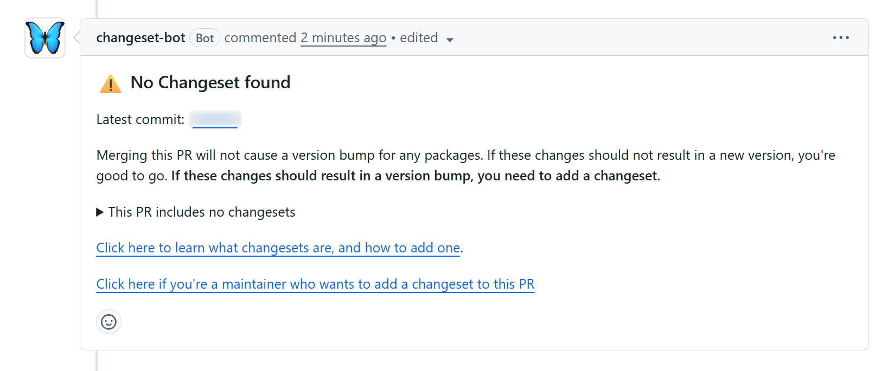

import Tabs from "@theme/Tabs";
import TabItem from "@theme/TabItem";

De meeste software is nooit echt af en zullen er in de loop van de tijd meerdere
versies van je applicatie, library, website of API bestaan.  
In [git] wordt per `commit` een log bijgehouden van welke bestanden er gewijzigd
zijn met een stukje commentaar erbij. Nu denk je misschien dat is een mooie
manier voor een "changelog", maar in git commits staat vaak veel ruis, denk aan
merge commits, documentatie-aanpassingen en onduidelijke commentaren. Hierin zie
je de "evolutie" van de code.

Het doel van een changelog is het documenteren van noemenswaardige aanpassingen,
vaak over meerdere commits. Het is voor de eindgebruiker.

## Hoe maak je een goede changelog?

Zoals op [Keep a changelog] in de richtlijnen staat:

- Changelogs zijn voor mensen, niet voor machines.

Een (eind)gebruiker moet in de changelog kunnen zien wat de wijzigingen zijn,
zijn er _deprecations_, is er iets vervallen, zijn er bugs gefixt, etc. Dit zijn
de vragen die ze hebben. Ook als je geen software hebt die "geconsumeerd" wordt
zoals een library of design system kan het handig zijn om een changelog bij te
houden, met bijvoorbeeld de nieuwe features van je website.

- Geef aan of je [Semantic Versioning] gebruikt.

Het wordt aangeraden om SemVer te gebruiken, de meeste ontwikkelaars kennen het
en ook niet-ontwikkelaars zullen het tegen zijn gekomen. Als je een andere
manier van versionering gebruikt, geef dit aan in je Changelog.

## Zijn er manieren om dit te automatiseren?

Er zijn verschillende tools om changelogs bij te houden. Sommige tools gebruiken
hiervoor de git commit comments, maar zoals hierboven al aangegeven is het beter
om _dedicated_ changelogs bij te houden.  
Andere tools helpen je per commit een change-bestandje aan te maken en die later
bij de release samen te voegen in de changelog. We zullen er hieronder een paar
behandelen.

Dat past goed bij een workflow met Pull Requests. Elke PR bevat dan alleen het
changelog-fragment voor die wijziging. Pas bij een release worden alle losse
fragmenten samengevoegd in `CHANGELOG.md`.

### Changesets

[Changesets] is een NPM-package,
[Github App](https://github.com/apps/changeset-bot) en
[-Action](https://github.com/changesets/changesets/action) voor je workflows.

Je installeert de package in je project met

<Tabs groupId="package-managers" defaultValue="pnpm">
  <TabItem value="npm">```bash npx @changesets/cli init ```</TabItem>
  <TabItem value="yarn">
    ```bash yarn add -D @changesets/cli && yarn changeset init ```
  </TabItem>
  <TabItem value="pnpm">```bash pnpx @changesets/cli init ```</TabItem>
</Tabs>

Werk je in Github dan is het aan te raden om de Github App te installeren in je
repository. Deze bot checkt elke Pull Request (PR) en kijkt of er een
change-bestand in de PR zit en plaatst een comment hierover.



:::tip Spreek met je team af hoe je aangeeft dat er geen change gelogd hoeft te
worden, bij developer.overheid.nl zetten we een 👍🏻 op de comment als het "okay"
is dat er geen changeset is. :::

Handmatig maak je een change-bestand aan met:

<Tabs groupId="package-managers" defaultValue="pnpm">
  <TabItem value="npm">```bash npx @changesets/cli ```</TabItem>
  <TabItem value="yarn">```bash yarn changeset ```</TabItem>
  <TabItem value="pnpm">```bash pnpm changeset ```</TabItem>
</Tabs>

Je beantwoordt een paar vragen, zoals wat voor soort wijziging het is (Major,
Minor, Patch) en een korte beschrijving. Daarna maakt Changesets een bestand aan
in `.changeset` met een unieke naam, bijvoorbeeld
`.changeset/green-sheep-search.md`:

```markdown
---
"@developer-overheid-nl/api-register": minor
"@developer-overheid-nl/oss-register": minor
---

Verbeterde filtering in het API- en OSS-register.
```

De Github Action zorgt ervoor dat Changesets een PR aanmaakt en bijhoudt om de
release te doen. De standaard naam is "Version Packages", deze is aan te passen
in de [workflow action](https://github.com/changesets/action#inputs).  
Het mergen van deze PR merged de Changelog met de nieuwe onderdelen van die
release en als de workflow ingesteld is om te publiceren naar Github en of NPM
wordt dat ook gedaan.

Meer documentatie over Changesets is te vinden in de
[Changesets Docs](https://github.com/changesets/changesets/blob/main/docs/intro-to-using-changesets.md).

### Changie

[Changie] is een kleine tool om, net als [Changesets], changelog-fragmenten bij
te houden in je repository. Ook hier maak je per wijziging een los YAML-bestand
aan. Deze bestanden komen standaard in `.changes/unreleased` te staan.

Je installeert Changie met:

```bash
go install github.com/miniscruff/changie@latest
```

Daarna maak je een nieuw fragment aan met:

```bash
changie new
```

Changie vraagt vervolgens om het type wijziging en een korte beschrijving. Dit
levert bijvoorbeeld een bestand op in `.changes/unreleased`:

```yaml
kind: Changed
body: Verbeter filtering in het API-register.
time: 2026-04-22T09:16:11.116493+02:00
```

In `.changie.yaml` configureer je hoe Changie werkt. Daarin leg je bijvoorbeeld
vast waar de fragmenten staan, waar de changelog naartoe wordt geschreven en
welke soorten wijzigingen je gebruikt.

Bij het API-register en OSS-register gebruiken we dezelfde categorieën als [Keep
a Changelog]:  
`Added`, `Changed`, `Deprecated`, `Removed`, `Fixed` en `Security`.  
Per categorie kun je ook aangeven welke SemVer-impact Changie automatisch moet
kiezen. Zo kan `Fixed` automatisch leiden tot een patch-release en `Added` tot
een minor-release:

```yaml
# changie.yaml
---
kinds:
  - label: Added
    auto: minor
  - label: Changed
    auto: major
  - label: Deprecated
    auto: minor
  - label: Removed
    auto: major
  - label: Fixed
    auto: patch
  - label: Security
    auto: patch
```

Een release maak je lokaal met:

```bash
changie batch <version>
changie merge
```

`changie batch` bundelt de losse fragmenten in een versiebestand onder
`.changes`, bijvoorbeeld `.changes/v2.1.0.md`. Daarna verwerkt `changie merge`
deze versie in `CHANGELOG.md`.

Bij developer.overheid.nl gebruiken we de
[Changie Action](https://github.com/miniscruff/changie-action) ook in de GitHub
workflow, bijvoorbeeld in `.github/workflows/changie-auto-release.yml`.

Op een Pull Request controleert de workflow of er een fragment is toegevoegd aan
`.changes/unreleased/*.yaml`.

Als dat ontbreekt, plaatst de workflow een reminder-comment op de PR. Als er wel
een fragment is gevonden, wordt die comment bijgewerkt naar
`Changie-fragment gevonden`.

Na een merge naar `main` doet de workflow het releasewerk automatisch met:

```bash
changie batch auto
changie merge
```

Daarna maakt de workflow een aparte Pull Request aan met de wijzigingen in
`CHANGELOG.md` en `.changes/**`.

Zo hoeft een feature-PR alleen het losse changelog-fragment mee te nemen. Het
bijwerken van de definitieve changelog gebeurt automatisch en apart. Dat
voorkomt merge-conflicten in `CHANGELOG.md` en houdt het releaseproces
overzichtelijk.

Meer documentatie over Changie is te vinden in de
[Changie Guide](https://changie.dev/guide/).

:::info Gebruikt jou organisatie al een andere tool of aanpak voor het bijhouden
van changelogs? Laat het ons weten, dan kunnen we deze documentatie uitbreiden!
:::

## Samenvatting

Een changelog is geen technische commitgeschiedenis, maar een overzicht van
relevante wijzigingen voor mensen.

Gebruik daarom duidelijke categorieën, schrijf begrijpelijke teksten en leg vast
hoe je versieert. Tools zoals [Changesets] en [Changie] kunnen helpen om dit
proces onderdeel te maken van je normale Pull Request- en releaseflow.

Voor teams die veel met Pull Requests werken is vooral de aanpak met losse
changelog-fragmenten prettig. Elke wijziging krijgt zijn eigen entry, terwijl de
definitieve changelog pas bij de release wordt samengesteld.

[git]: https://git-scm.com/
[Keep a changelog]: https://keepachangelog.com/nl/1.1.0/
[Semantic Versioning]: https://semver.org/lang/nl/
[Changesets]: https://github.com/changesets/changesets
[Changie]: https://changie.dev/
