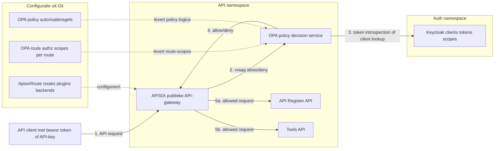

# API-authenticatie met APISIX, OPA en Keycloak

Developer.overheid.nl gebruikt een centrale API-gateway om API-verkeer te
authenticeren en autoriseren voordat requests bij achterliggende services
terechtkomen. Die auth-flow bestaat uit drie aparte diensten die elk een eigen
rol hebben:

- **APISIX** is de publieke API-gateway. Deze service ontvangt het request,
  draait gateway-plugins en routeert naar de juiste backend.
- **Open Policy Agent (OPA)** is een aparte policy-service. APISIX roept OPA per
  request aan via de `opa` plugin. OPA geeft alleen een beslissing terug:
  `allow` of `deny`.
- **Keycloak** is de identity provider en authorization server. OPA raadpleegt
  Keycloak voor token introspection en voor het valideren van API-key clients.

APISIX, OPA en Keycloak zijn dus geen onderdelen van één applicatie. Ze draaien
als losse services en praten via HTTP met elkaar. Deze scheiding houdt de
backends eenvoudiger. Zij hoeven niet zelf te weten hoe een token of API-key
gevalideerd wordt; ze ontvangen alleen requests die door de gateway zijn
toegestaan.

## Waarom deze opzet?

De API's worden door verschillende soorten clients gebruikt. Sommige clients
zijn vertrouwde server-side applicaties die veilig een client secret kunnen
bewaren. Andere clients, zoals browserapplicaties of publieke integraties,
kunnen dat niet. De gateway ondersteunt daarom twee toegangsmodellen:

- **Bearer token** voor vertrouwde clients. De client haalt via OAuth 2.0
  `client_credentials` een access token op bij Keycloak en stuurt dat mee in de
  `Authorization` header.
- **API-key** voor laagdrempelige of publieke integraties. De client stuurt een
  sleutel mee in de `x-api-key` header. OPA valideert deze sleutel via Keycloak
  en beperkt het gebruik standaard tot veilige routes.

In beide gevallen beslist OPA of het request door mag op basis van de route,
HTTP-methode en vereiste scopes.

## Request-flow

Dit diagram laat de service-topologie en request-flow samen zien. APISIX staat
aan de rand als publieke gateway. OPA is een aparte policy service die door
APISIX wordt aangeroepen. Keycloak is weer een aparte auth service die door OPA
wordt bevraagd voor tokens, clients en scopes.



De stippellijnen zijn configuratie uit Git. De doorgetrokken lijnen zijn runtime
verkeer. Backends krijgen alleen requests die via APISIX lopen en waarvoor OPA
`allow` teruggeeft.

## Stap 1: client krijgt credentials

Keycloak beheert de clients die toegang mogen krijgen tot de API's. Voor een
vertrouwde client wordt een confidential OIDC-client gebruikt met service
accounts. Deze client kan met `client_credentials` een access token aanvragen.

Een token bevat alleen de scopes die de client mag gebruiken en expliciet heeft
aangevraagd, bijvoorbeeld:

```http
POST /realms/don/protocol/openid-connect/token
Content-Type: application/x-www-form-urlencoded

grant_type=client_credentials&
client_id=voorbeeld-client&
client_secret=...&
scope=apis:read
```

Voor API-key gebruik wordt de sleutel gekoppeld aan een client in Keycloak. In
de huidige implementatie gebruikt de gateway die clientregistratie om te bepalen
of de sleutel bestaat. De set scopes die API-keys mogen gebruiken is beperkt in
de OPA-configuratie.

## Stap 2: APISIX ontvangt het request

APISIX is de publieke ingang voor de API's. Per route staan de gebruikelijke
gateway-taken geconfigureerd, zoals:

- routering naar de juiste Kubernetes-service;
- herschrijven van paden met `proxy-rewrite`;
- CORS-instellingen;
- aanroepen van de `opa` plugin.

De `opa` plugin stuurt het request en de routecontext door naar OPA. Daarbij is
`with_route` ingeschakeld, zodat OPA ook route-informatie kan gebruiken in de
autorisatiebeslissing.

## Stap 3: OPA beslist deny-by-default

OPA is de policy decision point. Het beleid wijst standaard af, tenzij een van
de ondersteunde credentials geldig is:

- een geldige `Authorization: Bearer ...` header;
- een geldige `x-api-key`, als de route en methode dat toestaan.

Als beide headers aanwezig zijn, krijgt de bearer token voorrang. Dat voorkomt
dat een request met een ongeldig token alsnog via een API-key wordt toegestaan.

OPA geeft bij een beslissing headers terug waarmee zichtbaar is dat de policy is
uitgevoerd, zoals `X-OPA-Checked`, `X-OPA-Decision` en `X-OPA-Policy`. Bij een
toegestaan request wordt ook de client-id doorgegeven in `X-OPA-Client-Id`.

## Stap 4: Keycloak valideert tokens en clients

Voor bearer tokens gebruikt OPA OAuth 2.0 token introspection. Keycloak geeft
terug of het token actief is en welke scopes eraan gekoppeld zijn. OPA
controleert daarna:

- of het token actief is;
- of het token niet verlopen is;
- of alle vereiste scopes aanwezig zijn.

Voor API-keys haalt OPA met een admin-token de Keycloak-client op die bij de
sleutel hoort. Bestaat de client, dan wordt de API-key als actief beschouwd en
krijgt deze alleen de vooraf toegestane API-key scopes.

:::warning[Ontwerpnotitie]

De directe runtime-interactie tussen OPA en Keycloak is vooral een praktische
implementatiekeuze. Als generiek patroon is dit niet ideaal: de policy service
wordt zo afhankelijk van de beschikbaarheid, latency en API-details van de
identity provider.

Een robuuster ontwerp is om OPA zoveel mogelijk te laten beslissen op basis van
informatie die al in het request of in lokale policy-data beschikbaar is. Denk
bijvoorbeeld aan JWT-validatie met JWKS en scopes/claims in het token, of aan
een gateway die tokens valideert en alleen de gevalideerde context aan OPA
doorgeeft. Voor API-keys ligt een aparte key- of clientregistratie dichter bij
de gateway vaak meer voor de hand dan een Keycloak admin lookup per request.

:::

## De volledige OPA-policy

De APISIX-routes verwijzen naar `policy: apisix/authz/result`. Dat betekent:
APISIX vraagt aan OPA om de waarde `result` op te halen uit het Rego-package
`apisix.authz`. Die `result` is het antwoord waarmee APISIX bepaalt of het
request door mag.

De policy doet in grote lijnen dit:

- **Deny-by-default**: zonder geldige `Authorization` header of toegestane
  `x-api-key` krijgt het request een `401`.
- **Bearer tokens eerst**: als er een bearer token aanwezig is, krijgt die
  voorrang boven `x-api-key`.
- **Keycloak-validatie**: bearer tokens worden via OAuth 2.0 token introspection
  gevalideerd; API-keys worden als Keycloak-client opgezocht.
- **Scopecontrole**: OPA vergelijkt de scopes uit het token of de API-key met de
  `required_scopes` uit de routeconfiguratie.
- **API-key beperking**: API-keys mogen standaard alleen `GET` doen, behalve als
  een route expliciet extra methodes toestaat met `allow_api_key_methods`.
- **Gateway headers**: bij allow/deny zet OPA headers zoals `X-OPA-Checked`,
  `X-OPA-Decision` en `X-OPA-Policy` terug naar APISIX.

De volledige policy ziet er zo uit:

```yaml
apiVersion: v1
kind: ConfigMap
metadata:
  name: opa-policy
data:
  apisix.rego: |
    package apisix.authz

    policy_name := "apisix.authz"

    # Default: afwijzen tenzij een bearer token of toegestane x-api-key flow slaagt.
    default result := {
      "allow": false,
      "reason": "Missing credentials (Authorization or x-api-key)",
      "status_code": 401,
      "headers": {
        "X-OPA-Checked": "true",
        "X-OPA-Decision": "deny",
        "X-OPA-Policy": "apisix.authz",
      },
    }

    default config := {}
    default route_auth_rules := []
    default configured_route_required_scopes := []
    default configured_route_api_key_methods := []

    default_allowed_api_key_scopes := [
      "apis:read",
      "organisations:read",
      "tools",
      "repositories:read",
      "gitOrganisations:read",
    ]

    # Config komt primair uit data.apisix_auth. Als die ontbreekt, valt OPA terug
    # op env vars die uit de Kubernetes secret worden ingeladen.
    config := data.apisix_auth if {
      data.apisix_auth
    }

    config := env_config if {
      not data.apisix_auth
      object.get(object.get(env_config, "keycloak", {}), "token_url", "") != ""
    }

    route_auth_rules := data.apisix_route_authz.rules if {
      data.apisix_route_authz.rules
    }

    mode := lower(object.get(config, "mode", "static"))
    api_key_header := lower(object.get(config, "api_key_header", "x-api-key"))
    request_method := upper(object.get(input.request, "method", ""))
    request_path := object.get(input.request, "path", object.get(input.request, "uri", ""))
    default_required_scopes := object.get(config, "default_required_scopes", [])
    allowed_api_key_scopes := object.get(
      config,
      "allowed_api_key_scopes",
      default_allowed_api_key_scopes,
    )

    env_config := {
      "mode": "keycloak",
      "keycloak": {
        "token_url": object.get(runtime_env, "OPA_KEYCLOAK_TOKEN_URL", ""),
        "introspection_url": object.get(runtime_env, "OPA_KEYCLOAK_INTROSPECTION_URL", ""),
        "admin_api_url": object.get(runtime_env, "OPA_KEYCLOAK_ADMIN_API_URL", ""),
        "client_id": object.get(runtime_env, "OPA_KEYCLOAK_CLIENT_ID", ""),
        "client_secret": object.get(runtime_env, "OPA_KEYCLOAK_CLIENT_SECRET", ""),
        "admin_grant_type": object.get(runtime_env, "OPA_KEYCLOAK_ADMIN_GRANT_TYPE", "client_credentials"),
      },
    } if {
      runtime_env := object.get(opa.runtime(), "env", {})
    }

    # Authorization heeft voorrang. Alleen als die ontbreekt, wordt x-api-key bekeken.
    result := response if {
      auth_header := object.get(input.request.headers, "authorization", "")
      auth_header != ""
      response := bearer_response(auth_header)
    }

    # x-api-key is standaard alleen toegestaan op GET endpoints.
    # Per route kan via labels.allow_api_key_methods expliciet een extra methode
    # worden toegestaan, bijvoorbeeld voor een server-side POST flow.
    result := response if {
      auth_header := object.get(input.request.headers, "authorization", "")
      auth_header == ""
      api_key := object.get(input.request.headers, api_key_header, "")
      api_key != ""
      api_key_allowed_for_method
      response := api_key_response(api_key)
    }

    result := deny("x-api-key is not allowed for this endpoint", 401) if {
      auth_header := object.get(input.request.headers, "authorization", "")
      auth_header == ""
      api_key := object.get(input.request.headers, api_key_header, "")
      api_key != ""
      not api_key_allowed_for_method
    }

    # Bearer tokens gaan via static lookup of Keycloak introspection, afhankelijk van mode.
    bearer_response(auth_header) := deny("Invalid Authorization header format", 401) if {
      not valid_bearer_header(auth_header)
    }

    bearer_response(auth_header) := deny(object.get(info, "error", "Unauthorized"), object.get(info, "status_code", 401)) if {
      valid_bearer_header(auth_header)
      token := bearer_token(auth_header)
      info := bearer_token_info(token)
      not object.get(info, "active", false)
    }

    bearer_response(auth_header) := deny("JWT token expired", 401) if {
      valid_bearer_header(auth_header)
      token := bearer_token(auth_header)
      info := bearer_token_info(token)
      object.get(info, "active", false)
      not token_not_expired(info)
    }

    bearer_response(auth_header) := deny("JWT does not have required scope", 403) if {
      valid_bearer_header(auth_header)
      token := bearer_token(auth_header)
      info := bearer_token_info(token)
      object.get(info, "active", false)
      token_not_expired(info)
      not all_required_scopes_present(info, required_scopes)
    }

    bearer_response(auth_header) := allow_response(info) if {
      valid_bearer_header(auth_header)
      token := bearer_token(auth_header)
      info := bearer_token_info(token)
      object.get(info, "active", false)
      token_not_expired(info)
      all_required_scopes_present(info, required_scopes)
    }

    api_key_response(api_key) := deny(object.get(info, "error", "Invalid API key"), object.get(info, "status_code", 401)) if {
      info := api_key_info(api_key)
      not object.get(info, "active", false)
    }

    api_key_response(api_key) := deny("API key does not have required scope", 403) if {
      info := api_key_info(api_key)
      object.get(info, "active", false)
      not all_required_scopes_present(info, required_scopes)
    }

    api_key_response(api_key) := allow_response(info) if {
      info := api_key_info(api_key)
      object.get(info, "active", false)
      all_required_scopes_present(info, required_scopes)
    }

    bearer_token_info(token) := info if {
      mode == "static"
      tokens := object.get(object.get(config, "static", {}), "bearer_tokens", {})
      info := object.get(tokens, token, {"active": false, "error": "Unauthorized", "status_code": 401})
    }

    bearer_token_info(token) := info if {
      mode == "keycloak"
      info := keycloak_bearer_info(token)
    }

    # API keys worden lokaal of via Keycloak gevalideerd en krijgen daarna scopes toegewezen.
    api_key_info(api_key) := info if {
      mode == "static"
      api_keys := object.get(object.get(config, "static", {}), "api_keys", {})
      info := object.get(api_keys, api_key, {"active": false, "error": "Invalid API key", "status_code": 401})
    }

    api_key_info(api_key) := info if {
      mode == "keycloak"
      info := keycloak_api_key_info(api_key)
    }

    keycloak_bearer_info(token) := object.get(resp, "body", {"active": false, "error": "Invalid token introspection response", "status_code": 500}) if {
      resp := keycloak_introspection_response(token)
      resp.status_code == 200
    }

    keycloak_bearer_info(token) := {"active": false, "error": object.get(object.get(resp, "error", {}), "message", "Failed to introspect token"), "status_code": 500} if {
      resp := keycloak_introspection_response(token)
      resp.status_code == 0
    }

    keycloak_bearer_info(token) := {"active": false, "error": "Token introspection failed", "status_code": 401} if {
      resp := keycloak_introspection_response(token)
      resp.status_code != 0
      resp.status_code != 200
    }

    keycloak_api_key_info(api_key) := {
      "active": true,
      "client_id": object.get(object.get(resp, "body", {}), "clientId", api_key),
      "scopes": allowed_api_key_scopes,
    } if {
      resp := keycloak_client_lookup_response(api_key)
      resp.status_code == 200
      client_id := object.get(object.get(resp, "body", {}), "clientId", "")
      client_id != ""
    }

    keycloak_api_key_info(api_key) := {"active": false, "error": object.get(object.get(resp, "error", {}), "message", "Failed to validate API key"), "status_code": 500} if {
      resp := keycloak_client_lookup_response(api_key)
      resp.status_code == 0
    }

    keycloak_api_key_info(api_key) := {"active": false, "error": "Invalid API key", "status_code": 401} if {
      resp := keycloak_client_lookup_response(api_key)
      resp.status_code != 0
      resp.status_code != 200
    }

    # Voor x-api-key wordt gecontroleerd of de client via de Keycloak admin API bestaat.
    keycloak_client_lookup_response(api_key) := resp if {
      kc := object.get(config, "keycloak", {})
      admin_token := keycloak_admin_token
      admin_token != ""
      lookup_url := sprintf("%s/%s", [trim_trailing_slash(object.get(kc, "admin_api_url", "")), api_key])
      resp := http.send({
        "method": "get",
        "url": lookup_url,
        "headers": {"Authorization": sprintf("Bearer %s", [admin_token])},
        "force_json_decode": true,
        "raise_error": false,
        "timeout": "5s",
        "cache": false,
      })
    }

    # Bearer validatie gebruikt OAuth2 introspection met de admin/client credentials.
    keycloak_introspection_response(token) := resp if {
      kc := object.get(config, "keycloak", {})
      body := urlquery.encode_object({
        "token": token,
        "client_id": object.get(kc, "client_id", ""),
        "client_secret": object.get(kc, "client_secret", ""),
      })
      resp := http.send({
        "method": "post",
        "url": keycloak_introspection_url(kc),
        "raw_body": body,
        "headers": {"Content-Type": "application/x-www-form-urlencoded"},
        "force_json_decode": true,
        "raise_error": false,
        "timeout": "5s",
        "cache": true,
      })
    }

    keycloak_admin_token := access_token if {
      kc := object.get(config, "keycloak", {})
      resp := keycloak_admin_token_response
      resp.status_code == 200
      access_token := object.get(object.get(resp, "body", {}), "access_token", "")
      access_token != ""
      object.get(kc, "token_url", "") != ""
    }

    keycloak_admin_token := "" if {
      resp := keycloak_admin_token_response
      resp.status_code != 200
    }

    keycloak_admin_token_response := resp if {
      kc := object.get(config, "keycloak", {})
      grant_type := lower(object.get(kc, "admin_grant_type", "client_credentials"))
      grant_type == "password"
      body := urlquery.encode_object({
        "grant_type": "password",
        "client_id": object.get(kc, "client_id", "admin-cli"),
        "username": object.get(kc, "admin_username", ""),
        "password": object.get(kc, "admin_password", ""),
      })
      resp := http.send({
        "method": "post",
        "url": object.get(kc, "token_url", ""),
        "raw_body": body,
        "headers": {"Content-Type": "application/x-www-form-urlencoded"},
        "force_json_decode": true,
        "raise_error": false,
        "timeout": "5s",
      })
    }

    keycloak_admin_token_response := resp if {
      kc := object.get(config, "keycloak", {})
      grant_type := lower(object.get(kc, "admin_grant_type", "client_credentials"))
      grant_type != "password"
      body := urlquery.encode_object({
        "grant_type": "client_credentials",
        "client_id": object.get(kc, "client_id", ""),
        "client_secret": object.get(kc, "client_secret", ""),
      })
      resp := http.send({
        "method": "post",
        "url": object.get(kc, "token_url", ""),
        "raw_body": body,
        "headers": {"Content-Type": "application/x-www-form-urlencoded"},
        "force_json_decode": true,
        "raise_error": false,
        "timeout": "5s",
      })
    }

    keycloak_introspection_url(kc) := introspection_url if {
      introspection_url := object.get(kc, "introspection_url", "")
      introspection_url != ""
    }

    keycloak_introspection_url(kc) := token_url if {
      introspection_url := object.get(kc, "introspection_url", "")
      introspection_url == ""
      token_url := object.get(kc, "token_url", "")
      endswith(token_url, "/introspect")
    }

    keycloak_introspection_url(kc) := concat("", [trim_trailing_slash(object.get(kc, "token_url", "")), "/introspect"]) if {
      introspection_url := object.get(kc, "introspection_url", "")
      introspection_url == ""
      token_url := object.get(kc, "token_url", "")
      not endswith(token_url, "/introspect")
    }

    valid_bearer_header(auth_header) if {
      parts := non_empty_parts(auth_header)
      count(parts) == 2
      lower(parts[0]) == "bearer"
    }

    bearer_token(auth_header) := parts[1] if {
      parts := non_empty_parts(auth_header)
      count(parts) == 2
      lower(parts[0]) == "bearer"
    }

    non_empty_parts(value) := parts if {
      raw_parts := split(value, " ")
      parts := [part | part := raw_parts[_]; part != ""]
    }

    # Vereiste scopes komen bij ApisixRoute uit data.apisix_route_authz.
    # De oude route labels blijven als fallback beschikbaar tijdens migraties.
    required_scopes := scopes if {
      scopes := configured_route_required_scopes
      count(scopes) > 0
    }

    required_scopes := scopes if {
      count(configured_route_required_scopes) == 0
      scopes := route_required_scopes
      count(scopes) > 0
    }

    required_scopes := default_required_scopes if {
      count(configured_route_required_scopes) == 0
      count(route_required_scopes) == 0
    }

    configured_route_required_scopes := scopes if {
      rule := route_auth_rule
      scopes := object.get(rule, "required_scopes", [])
    }

    route_required_scopes := scopes if {
      raw := object.get(object.get(object.get(input, "route", {}), "labels", {}), "required_scopes", "")
      raw != ""
      scopes := [trim_space(scope) | scope := split(raw, ",")[_]; trim_space(scope) != ""]
    }

    route_required_scopes := [] if {
      raw := object.get(object.get(object.get(input, "route", {}), "labels", {}), "required_scopes", "")
      raw == ""
    }

    token_not_expired(info) if {
      object.get(info, "exp", 0) == 0
    }

    token_not_expired(info) if {
      exp := object.get(info, "exp", 0)
      exp > time.now_ns() / 1000000000
    }

    all_required_scopes_present(info, scopes) if {
      every scope in scopes {
        granted_scope(info, scope)
      }
    }

    granted_scope(info, scope) if {
      scopes := object.get(info, "scopes", [])
      scope in scopes
    }

    granted_scope(info, scope) if {
      scope_string := object.get(info, "scope", "")
      scope_string != ""
      scope in split(scope_string, " ")
    }

    api_key_allowed_for_method if {
      request_method == "GET"
    }

    api_key_allowed_for_method if {
      request_method in configured_route_api_key_methods
    }

    api_key_allowed_for_method if {
      count(configured_route_api_key_methods) == 0
      request_method in route_api_key_methods
    }

    configured_route_api_key_methods := methods if {
      rule := route_auth_rule
      methods := object.get(rule, "allow_api_key_methods", [])
    }

    route_api_key_methods := methods if {
      raw := object.get(object.get(object.get(input, "route", {}), "labels", {}), "allow_api_key_methods", "")
      raw != ""
      methods := [upper(trim_space(method)) | method := split(raw, ",")[_]; trim_space(method) != ""]
    }

    route_api_key_methods := [] if {
      raw := object.get(object.get(object.get(input, "route", {}), "labels", {}), "allow_api_key_methods", "")
      raw == ""
    }

    allow_response(info) := {
      "allow": true,
      "headers": {
        "X-OPA-Checked": "true",
        "X-OPA-Decision": "allow",
        "X-OPA-Policy": policy_name,
        "X-OPA-Client-Id": object.get(info, "client_id", object.get(info, "azp", "")),
      },
    }

    deny(reason, status_code) := {
      "allow": false,
      "reason": reason,
      "status_code": status_code,
      "headers": {
        "X-OPA-Checked": "true",
        "X-OPA-Decision": "deny",
        "X-OPA-Policy": policy_name,
      },
    }

    trim_trailing_slash(value) := trimmed if {
      trimmed := trim_right(value, "/")
    }

    route_auth_rule := rule if {
      matching := [candidate |
        candidate := route_auth_rules[_]
        route_auth_rule_matches(candidate)
      ]
      count(matching) > 0
      max_score := max([route_auth_rule_specificity(candidate) | candidate := matching[_]])
      rule := matching[_]
      route_auth_rule_specificity(rule) == max_score
    }

    route_auth_rule_matches(rule) if {
      request_method in object.get(rule, "methods", [])
      some path in object.get(rule, "paths", [])
      path_matches(path, request_path)
    }

    route_auth_rule_specificity(rule) := score if {
      scores := [count(trim_right(path, "*")) |
        path := object.get(rule, "paths", [])[_]
        path_matches(path, request_path)
      ]
      score := max(scores)
    }

    path_matches(pattern, path) if {
      not contains(pattern, "*")
      pattern == path
    }

    path_matches(pattern, path) if {
      endswith(pattern, "*")
      prefix := trim_right(pattern, "*")
      startswith(path, prefix)
    }
```

## Stap 5: scopes per route

De vereiste scopes staan niet hardcoded in de backend. Ze worden per route
geconfigureerd in de gateway/policy-configuratie. Voorbeelden:

| Route                    | Methode | Scope        |
| ------------------------ | ------- | ------------ |
| `/api-register/v1/apis`  | `GET`   | `apis:read`  |
| `/api-register/v1/apis`  | `POST`  | `apis:write` |
| `/tools/v1/oas/validate` | `POST`  | `tools`      |

Hieronder staat de volledige gateway- en policyconfiguratie voor deze drie
routes. In de APISIX-configuratie staan de route, rewrite, CORS, OPA-plugin,
timeout en backend-service. In de OPA-routeconfiguratie staat welke scope per
route nodig is.

```yaml
apiVersion: apisix.apache.org/v2
kind: ApisixRoute
metadata:
  name: api-routes
spec:
  ingressClassName: apisix
  http:
    - name: tools-api-v1-validatoropenapipost
      match:
        paths:
          - "/tools/v1/oas/validate"
        methods:
          - POST
      plugins:
        - name: proxy-rewrite
          enable: true
          config:
            regex_uri:
              - "^/tools/(.*)"
              - "/$1"
            use_real_request_uri_unsafe: false
        - name: cors
          enable: true
          config:
            allow_origins: "*"
            allow_credential: false
            allow_headers: Authorization,Content-Type
            allow_methods: POST,OPTIONS
            max_age: 5
        - name: opa
          enable: true
          config:
            host: http://don-api-opa:8181
            policy: apisix/authz/result
            timeout: 3000
            with_route: true
      timeout:
        connect: 60s
        send: 60s
        read: 60s
      backends:
        - serviceName: tools-svc
          servicePort: 1338

    - name: api-register-api-v1-listapis
      match:
        paths:
          - "/api-register/v1/apis"
        methods:
          - GET
      plugins:
        - name: proxy-rewrite
          enable: true
          config:
            regex_uri:
              - "^/api-register/(.*)"
              - "/$1"
            use_real_request_uri_unsafe: false
        - name: cors
          enable: true
          config:
            allow_origins: "*"
            allow_credential: false
            allow_headers: Authorization,x-api-key,Content-Type
            allow_methods: GET,OPTIONS
            max_age: 5
        - name: opa
          enable: true
          config:
            host: http://don-api-opa:8181
            policy: apisix/authz/result
            timeout: 3000
            with_route: true
      timeout:
        connect: 60s
        send: 60s
        read: 60s
      backends:
        - serviceName: api-register-svc
          servicePort: 1337

    - name: api-register-api-v1-createapi
      match:
        paths:
          - "/api-register/v1/apis"
        methods:
          - POST
      plugins:
        - name: proxy-rewrite
          enable: true
          config:
            regex_uri:
              - "^/api-register/(.*)"
              - "/$1"
            use_real_request_uri_unsafe: false
        - name: cors
          enable: true
          config:
            allow_origins: "*"
            allow_credential: false
            allow_headers: Authorization,Content-Type
            allow_methods: POST,OPTIONS
            max_age: 5
        - name: opa
          enable: true
          config:
            host: http://don-api-opa:8181
            policy: apisix/authz/result
            timeout: 3000
            with_route: true
      timeout:
        connect: 60s
        send: 60s
        read: 60s
      backends:
        - serviceName: api-register-svc
          servicePort: 1337
```

De vereiste scopes staan vervolgens in de OPA-routeconfiguratie. De `name`,
`methods` en `paths` sluiten aan op de APISIX-routes hierboven.

```yaml
apiVersion: v1
kind: ConfigMap
metadata:
  name: opa-route-authz
data:
  apisix-route-authz.json: |
    {
      "apisix_route_authz": {
        "rules": [
          {
            "name": "tools-api-v1-validatoropenapipost",
            "methods": [
              "POST"
            ],
            "paths": [
              "/tools/v1/oas/validate"
            ],
            "required_scopes": [
              "tools"
            ],
            "allow_api_key_methods": [
              "POST"
            ]
          },
          {
            "name": "api-register-api-v1-listapis",
            "methods": [
              "GET"
            ],
            "paths": [
              "/api-register/v1/apis"
            ],
            "required_scopes": [
              "apis:read"
            ],
            "allow_api_key_methods": []
          },
          {
            "name": "api-register-api-v1-createapi",
            "methods": [
              "POST"
            ],
            "paths": [
              "/api-register/v1/apis"
            ],
            "required_scopes": [
              "apis:write"
            ],
            "allow_api_key_methods": []
          }
        ]
      }
    }
```

OPA kiest de meest specifieke regel die past bij de requestmethode en het pad.
Als er geen routespecifieke scope is, valt OPA terug op de default scopes uit de
auth-configuratie.

## API-key gebruik beperken

API-keys zijn bewust beperkter dan bearer tokens. In de huidige policy zijn
API-keys standaard alleen toegestaan voor `GET` requests. Per route kan daarvan
worden afgeweken met `allow_api_key_methods`, bijvoorbeeld voor een server-side
tool-endpoint die een `POST` nodig heeft.

:::warning[Gebruik zo min mogelijk API-keys]

API-keys lekken vaak makkelijker uit dan een kortlevend bearer token. Gebruik
API-keys daarom alleen voor routes waar dat bewust is afgewogen.

:::

## Foutgedrag

De gateway geeft vroeg in de keten een fout terug als authenticatie of
autorisatie faalt:

- `401 Unauthorized` bij ontbrekende, ongeldige of verlopen credentials;
- `403 Forbidden` als de credential geldig is, maar de vereiste scope mist.

Backends hoeven deze controles daardoor niet opnieuw te implementeren. Ze mogen
wel aanvullende domeinautorisatie uitvoeren als de operatie dat vereist.

## Ontwerpkeuzes

- **Authenticatie centraal aan de rand**: APISIX en OPA houden ongeldige
  requests buiten de achterliggende services.
- **Policy als code**: autorisatieregels staan in Rego, de policy-taal van Open
  Policy Agent, en in routeconfiguratie. Daardoor kunnen ze samen met de
  infrastructuur worden gereviewd.
- **Keycloak als bron voor clients en scopes**: clientregistratie, secrets en
  OAuth/OIDC-instellingen blijven op één plek.
- **Deny-by-default**: nieuwe routes zijn niet impliciet open.
- **Scopes dicht bij routes**: API-contract en gatewayconfiguratie blijven
  inhoudelijk op elkaar aansluiten.

## Zie ook

- [OAuth 2.0](./oauth.md)
- [OpenID Connect (OIDC)](./oidc.md)
- [API Design Rules](../../api-ontwikkeling/standaarden/api-design-rules/)
