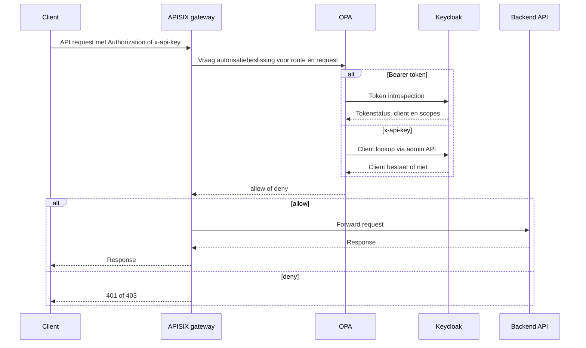

# API-authenticatie met APISIX, OPA en Keycloak

Developer.overheid.nl gebruikt een centrale API-gateway om API-verkeer te
authenticeren en autoriseren voordat requests bij achterliggende services
terechtkomen. De gateway is opgebouwd rond drie componenten:

- **APISIX** routeert requests naar de juiste backend en voert gateway-plugins
  uit.
- **Open Policy Agent (OPA)** neemt per request de autorisatiebeslissing.
- **Keycloak** is de identity provider en authorization server voor clients,
  tokens en scopes.

Deze scheiding houdt de backends eenvoudiger. Zij hoeven niet zelf te weten hoe
een token of API-key gevalideerd wordt; ze ontvangen alleen requests die door de
gateway zijn toegestaan.

## Waarom deze opzet?

De API's worden door verschillende soorten clients gebruikt. Sommige clients
zijn vertrouwde server-side applicaties die veilig een client secret kunnen
bewaren. Andere clients, zoals browserapplicaties of publieke integraties,
kunnen dat niet. De gateway ondersteunt daarom twee toegangsmodellen:

- **Bearer token** voor vertrouwde clients. De client haalt via OAuth 2.0
  `client_credentials` een access token op bij Keycloak en stuurt dat mee in de
  `Authorization` header.
- **API-key** voor laagdrempelige of publieke integraties. De client stuurt een
  sleutel mee in de `x-api-key` header. OPA valideert deze sleutel via Keycloak
  en beperkt het gebruik standaard tot veilige routes.

In beide gevallen beslist OPA of het request door mag op basis van de route,
HTTP-methode en vereiste scopes.

## Request-flow



## Stap 1: client krijgt credentials

Keycloak beheert de clients die toegang mogen krijgen tot de API's. Voor een
vertrouwde client wordt een confidential OIDC-client gebruikt met service
accounts. Deze client kan met `client_credentials` een access token aanvragen.

Een token bevat alleen de scopes die de client mag gebruiken en expliciet heeft
aangevraagd, bijvoorbeeld:

```http
POST /realms/don/protocol/openid-connect/token
Content-Type: application/x-www-form-urlencoded

grant_type=client_credentials&
client_id=voorbeeld-client&
client_secret=...&
scope=apis:read
```

Voor API-key gebruik wordt de sleutel gekoppeld aan een client in Keycloak. In
de huidige implementatie gebruikt de gateway die clientregistratie om te bepalen
of de sleutel bestaat. De set scopes die API-keys mogen gebruiken is beperkt in
de OPA-configuratie.

## Stap 2: APISIX ontvangt het request

APISIX is de publieke ingang voor de API's. Per route staan de gebruikelijke
gateway-taken geconfigureerd, zoals:

- routering naar de juiste Kubernetes-service;
- herschrijven van paden met `proxy-rewrite`;
- CORS-instellingen;
- aanroepen van de `opa` plugin.

De `opa` plugin stuurt het request en de routecontext door naar OPA. Daarbij is
`with_route` ingeschakeld, zodat OPA ook route-informatie kan gebruiken in de
autorisatiebeslissing.

## Stap 3: OPA beslist deny-by-default

OPA is de policy decision point. Het beleid wijst standaard af, tenzij een van
de ondersteunde credentials geldig is:

- een geldige `Authorization: Bearer ...` header;
- een geldige `x-api-key`, als de route en methode dat toestaan.

Als beide headers aanwezig zijn, krijgt de bearer token voorrang. Dat voorkomt
dat een request met een ongeldig token alsnog via een API-key wordt toegestaan.

OPA geeft bij een beslissing headers terug waarmee zichtbaar is dat de policy is
uitgevoerd, zoals `X-OPA-Checked`, `X-OPA-Decision` en `X-OPA-Policy`. Bij een
toegestaan request wordt ook de client-id doorgegeven in `X-OPA-Client-Id`.

## Stap 4: Keycloak valideert tokens en clients

Voor bearer tokens gebruikt OPA OAuth 2.0 token introspection. Keycloak geeft
terug of het token actief is en welke scopes eraan gekoppeld zijn. OPA
controleert daarna:

- of het token actief is;
- of het token niet verlopen is;
- of alle vereiste scopes aanwezig zijn.

Voor API-keys haalt OPA met een admin-token de Keycloak-client op die bij de
sleutel hoort. Bestaat de client, dan wordt de API-key als actief beschouwd en
krijgt deze alleen de vooraf toegestane API-key scopes.

## Stap 5: scopes per route

De vereiste scopes staan niet hardcoded in de backend. Ze worden per route
geconfigureerd in de gateway/policy-configuratie. Voorbeelden:

| Route                    | Methode | Scope        |
| ------------------------ | ------- | ------------ |
| `/api-register/v1/apis`  | `GET`   | `apis:read`  |
| `/api-register/v1/apis`  | `POST`  | `apis:write` |
| `/tools/v1/oas/validate` | `POST`  | `tools`      |

OPA kiest de meest specifieke regel die past bij de requestmethode en het pad.
Als er geen routespecifieke scope is, valt OPA terug op de default scopes uit de
auth-configuratie.

## API-key gebruik beperken

API-keys zijn bewust beperkter dan bearer tokens. In de huidige policy zijn
API-keys standaard alleen toegestaan voor `GET` requests. Per route kan daarvan
worden afgeweken met `allow_api_key_methods`, bijvoorbeeld voor een server-side
tool-endpoint dat een `POST` nodig heeft.

Deze beperking is belangrijk omdat een API-key vaak makkelijker uitlekt dan een
kortlevend bearer token. Gebruik API-keys daarom alleen voor routes waar dat
bewust is afgewogen.

## Foutgedrag

De gateway geeft vroeg in de keten een fout terug als authenticatie of
autorisatie faalt:

- `401 Unauthorized` bij ontbrekende, ongeldige of verlopen credentials;
- `403 Forbidden` als de credential geldig is, maar de vereiste scope mist.

Backends hoeven deze controles daardoor niet opnieuw te implementeren. Ze mogen
wel aanvullende domeinautorisatie uitvoeren als de operatie dat vereist.

## Ontwerpkeuzes

- **Authenticatie centraal aan de rand**: APISIX en OPA houden ongeldige
  requests buiten de achterliggende services.
- **Policy als code**: autorisatieregels staan in Rego en routeconfiguratie, en
  kunnen samen met de infrastructuur worden gereviewd.
- **Keycloak als bron voor clients en scopes**: clientregistratie, secrets en
  OAuth/OIDC-instellingen blijven op één plek.
- **Deny-by-default**: nieuwe routes zijn niet impliciet open.
- **Scopes dicht bij routes**: API-contract en gatewayconfiguratie blijven
  inhoudelijk op elkaar aansluiten.

## Zie ook

- [OAuth 2.0](./oauth.md)
- [OpenID Connect (OIDC)](./oidc.md)
- [API Design Rules](../../api-ontwikkeling/standaarden/api-design-rules/)
